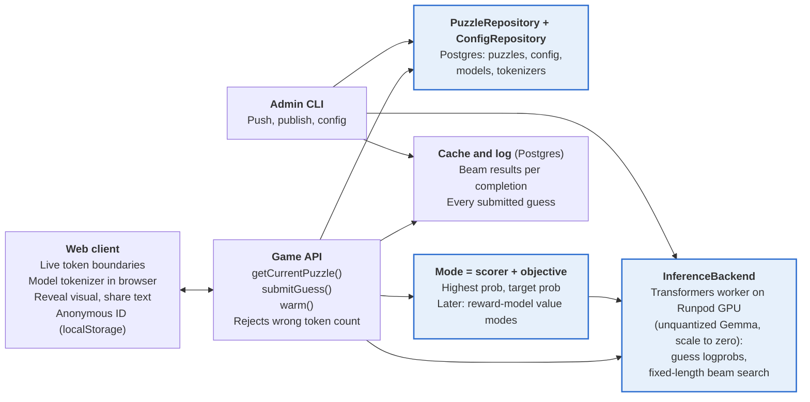

# Clankerdle — Prototype PRD

Oct 3, 2026 · @Griffin

*Revised: puzzles and config are stored in Postgres; the inference backend is Hugging Face transformers on Runpod GPU workers that scale to zero, woken when a player opens a puzzle; the launch model is Gemma 4 E2B (base), unquantized for now; the stack is set in `notes.md`. Implementation details are in `plan.md`.*

## Overview

Clankerdle is a Wordle-style web game where players try to write like a base model. The game always serves the latest puzzle, which is made of several chat completions. Each completion shows a prompt and a partial assistant response, and the player types the next N tokens. The game scores the guess by the model's log probabilities.

The audience is AI nerds. The tone winks at Wordle and lightly mocks the AI-nerd crowd, players included. The premise is satirical: everyone online is a bot anyway, so you might as well try to sound like one.

This PRD covers a prototype for internal playtesting by the dev team only. Nothing here is meant to survive contact with a real launch. Once a mode proves fun, the product gets redesigned from the ground up.

## Goals and non-goals

The prototype exists to find out which mode and rule set is fun, as cheaply as possible.

**Goals**

- Ship a playable puzzle in two modes: highest probability and target probability.
- Make the rules easy to change without rewrites or redeploys. That covers modes, scoring, guesses per completion, token count, model, sampling settings, and the share format.
- Keep the puzzle source, the inference backend, and the mode logic behind interfaces, so each can be swapped independently.
- Leave room for future modes, such as reward-model value modes, without building them now.

**Non-goals for the prototype**

- Accounts, logins, streaks, history, or cross-device sync
- Leaderboards or anti-cheat. Open weights mean anyone can run the model locally, and that's fine.
- Archive or practice modes
- A/B testing infrastructure. Devs change the live config directly.
- Reward-model value modes (highest, lowest, or target value)
- A lowest-probability mode, which would just reward gibberish
- Mobile polish. It should work acceptably on mobile web, but it isn't a priority.
- Native apps, monetization, and business metrics

## Core gameplay loop

The game always serves the latest puzzle, meaning the one with the highest puzzle number. There's no fixed release schedule: a new puzzle is live as soon as devs publish it, and it's the same for every player. If a player hasn't played the latest puzzle, it's available to them. If nothing has been published yet, or the server can't reach its database, the player sees a themed error screen instead of a puzzle. A puzzle is an ordered sequence of two or more completions, and one mode applies to the whole puzzle.

1. The player opens the site and sees the latest puzzle's number, its mode, and (in target mode) the target. The first visit may show a short "getting the puzzle ready…" state while the puzzle and the model's tokenizer load.
2. For each completion, the player sees the prompt and the partial assistant response, followed by a free-text input sized for N tokens. N is set per completion.
3. The player types. The input re-tokenizes on every keystroke with the puzzle model's tokenizer and shows the live token boundaries, along with a counter such as "3 / 5 tokens".
4. Submit stays disabled until the text comes out to exactly N tokens.
5. On submit, the server scores the guess, and the reveal for that completion appears (see Reveal, results, and sharing). If scoring fails, the guess isn't used up and the player can retry.
6. After the last completion, the player sees the total score and a share button.

### Token-guided input

The input is a single free-text field, not a row of per-token blanks. Token boundaries move as the player types (for example, "un" becomes "unbel" and then "unbelievable"), so the boundaries have to be drawn dynamically.

- Tokens are marked with alternating background tints or underlines, updated on every keystroke. Leading spaces must be visible, since " the" and "the" are different tokens.
- The tokenizer runs client-side for instant feedback. The server re-tokenizes on submit and is authoritative.
- The guess is tokenized on its own and appended to the context's token IDs. It is not re-tokenized together with the partial completion, so the boundaries the player sees match exactly what gets scored.
- If the text is too long or too short, the counter turns to an error state and submit stays blocked.

## Game modes and scoring

Both modes score a guess by L, the sum of its token log probabilities under the puzzle's model and context. In both modes, lower is better, and the puzzle total is the sum of the per-completion scores.

```math
L = \sum_{i=1}^{N} \log p(t_i \mid \text{context}, t_{<i})
```

### Highest probability

The player tries to write the most likely N tokens. The score is the gap between the best beam-search sequence's sum (L_beam) and the player's sum (L_player).

```math
\text{score} = L_{\text{beam}} - L_{\text{player}}
```

Beam search is not guaranteed to find the true maximum. A player who beats it gets a negative score. That's allowed, should be celebrated in the UI, and should be logged so devs can see how often it happens.

### Target probability

The puzzle author sets a target log-probability sum (L_target) for each completion. The player tries to write N tokens whose sum lands as close as possible to it. Distance is measured in log space.

```math
\text{score} = \lvert L_{\text{player}} - L_{\text{target}} \rvert
```

### Scoring rules that apply to both modes

- Log probabilities come from the model with the puzzle's configured sampling parameters applied. For example, temperature rescales the logits before softmax. The defaults are raw logits (temperature 1, no top-p or top-k truncation).
- A token that the sampling settings truncate away (for example, outside top-p) has zero probability. It gets a fixed floor log probability instead of negative infinity and is flagged in the reveal.
- Beam search runs once per completion, for exactly N tokens, and the results are cached. It is never run per player.
- Beating the beam requires a margin larger than a small epsilon, so floating-point noise doesn't count as a win.
- Beam results must be restricted to sequences a player can actually type. A sequence whose decoded text re-tokenizes differently can't be entered, so it must not set the bar in highest-probability mode.
- Mode logic is a pluggable objective, so new objectives can be added without touching the scorer (see Architecture).

## Reveal, results, and sharing

The reveal is the payoff of each completion, so it gets the most visual polish in the prototype.

**Per-completion reveal**

- An eye-catching visual of the per-token log probabilities of the player's guess. For example, each token is shaded or sized by its probability, with the value on hover or tap, so the player can see exactly which token sank them.
- The completion score, the mode's reference value (L_beam or L_target), and a flourish when the player beats the beam.
- A "reveal top answers" control that shows the top-k beam-search sequences with their sums. It is opt-in, and k is configurable.

**End of puzzle**

- Total score, with per-completion scores.
- A copyable share result. The default format is the puzzle number, one emoji square per completion colored by score band, and a summary line, for example "Clankerdle #12 — 🟩🟨🟥 — 87% clanker".
- The share format is a pluggable formatter with configurable score bands and copy, so it can be changed without touching game logic.

A player who has already finished the latest puzzle sees their results instead of a fresh puzzle, until a newer puzzle is published (see Player identity and data).

## Architecture and extensibility

The architecture serves one requirement: change the rules, the content source, or the model without rewriting the game. Three interfaces carry that requirement. A config repository and a pluggable share formatter on the client support them.

Figure: prototype architecture. Highlighted nodes are the swappable interfaces: swap the implementation, keep the game.



The client talks only to the game API. The API loads puzzles and config through repositories, scores through the puzzle's Mode, and the Mode's scorer calls InferenceBackend. The game API only reads puzzles and config; all writes go through the admin CLI.

```ts
// The API is Rust and the client is React + TypeScript (see notes.md). These signatures are illustrative.
interface PuzzleRepository {
  getCurrentPuzzle(): Promise<Puzzle> // latest published puzzle
  getPuzzle(id: string): Promise<Puzzle>
}

interface ConfigRepository {
  getConfig(): Promise<AppConfig>              // global rules, scoring, share config
  getModel(name: string): Promise<ModelConfig> // known models
  getTokenizer(id: string): Promise<Tokenizer> // the model's tokenizer.json
}

interface InferenceBackend {
  scoreTokens(model: ModelConfig, context: TokenIds, guess: TokenIds): Promise<number[]> // per-token logprobs
  beamSearch(model: ModelConfig, context: TokenIds, n: number, width: number): Promise<Beam[]> // all `width` final beams
  warm(model: ModelConfig): Promise<void> // wake the worker ahead of the first guess
}

interface Scorer    { score(completion: Completion, guess: TokenIds): Promise<ScoredGuess> }
interface Objective { reference(completion: Completion): Promise<number>; score(value: number, reference: number): number }
interface Mode      { id: string; scorer: Scorer; objective: Objective }

interface ShareFormatter { format(result: PuzzleResult): string }
```

**Modes are compositions.** A mode pairs a scorer (what is measured) with an objective (what counts as good). Highest probability is the logprob scorer plus "close the gap to the best beam." Target probability is the logprob scorer plus "get close to the target." A reward-model value mode would later be a new scorer reusing the same objectives, which is the test that the abstraction is right. Guesses per completion is a rules setting read by the game loop, not by the modes.

**InferenceBackend on Hugging Face transformers.** A custom Python worker on Runpod Serverless GPU workers runs the model with PyTorch and transformers. For now that means unquantized Gemma 4 E2B, baked into the worker image. The weights revision and the GPU type are pinned, because either one can shift scores slightly. A different quantization, engine (such as llama.cpp), or GPU type may come later. Adding a model means building and deploying a new worker image, but no game deploy. After a worker rebuild or a hardware change, devs explicitly refresh the cached beams. They're never recomputed automatically, so the bar can't move in the middle of a playtest. The worker keeps the engine behind its own interface, so none of these changes touches the game. Each quantization is registered as a separate model, because its scores aren't comparable with another quantization's. Scoring an arbitrary guess needs the log probabilities of tokens the model did not generate. The worker runs one forward pass over the context plus the guess, applies the sampling settings to the full logits, and reads off each guess token's log probability. Beam search is a custom loop that produces exactly N tokens and never picks special tokens. The API then drops sequences that don't survive a decode-and-retokenize round trip, and re-scores the rest through the same path as player guesses. Each submission costs one forward pass. Beam search runs once per completion when the puzzle is published (or on first request as a fallback), and the result is cached. A high-throughput engine such as vLLM isn't needed at prototype scale, and it can be swapped in behind the same interface later.

**Cold starts.** To keep prototype costs negligible, there's no always-on worker: the GPU endpoint scales to zero. A cold start takes tens of seconds, so the client asks the API to wake the worker as soon as a player opens a puzzle they haven't finished. The model loads while they read and type, and a themed "waking the clanker…" state covers any remaining wait. If that isn't enough, the next steps are a lighter quantization or engine, and an always-on worker only as a last resort.

**Rendering chats for a base model.** Base models have no chat format, so each model config includes a text template that turns the prompt and partial completion into raw text, for example `User: …\n\nAssistant: …`. The template is part of the context, and changing it changes every score.

**Client tokenizer.** The browser loads the puzzle model's tokenizer (for example, a Hugging Face `tokenizer.json` via a WASM or JS tokenizer library) from the API, so live boundaries always match the server. The API serves the same tokenizer file it uses itself, stored in the database. The file is large (around 10 MB compressed for Gemma), but it never changes, so the browser caches it and players download it once per model. While it loads, the client shows a themed "getting the puzzle ready…" state. Players who have already finished the latest puzzle skip it, since the results screen doesn't need the tokenizer.

## Puzzle authoring format

Puzzles are stored in Postgres. Devs hand-write each puzzle as a YAML file and import it with the admin CLI (`clankerdle puzzle push`), which saves it as a draft. `clankerdle puzzle publish` validates it, precomputes its beams, and makes it live. There's no deploy step. The YAML file is only an authoring format; the database is the source of truth, and the CLI can export a puzzle back to YAML for editing. Code reads puzzles through the PuzzleRepository interface. A sample puzzle:

```yaml
id: 2026-10-05
number: 12
mode: target_probability        # or highest_probability
model:
  name: gemma-4-e2b-bf16        # a model registered in the database (Gemma 4 E2B base, not -it, unquantized)
  sampling:                     # optional; overrides the model's default sampling
    temperature: 1.0
    top_p: null
    top_k: null
  template: "User: {prompt}\n\nAssistant: {partial}"   # optional; overrides the model's default template
rules:                           # optional overrides of global defaults
  guesses_per_completion: 1
  reveal_top_k: 5
  beam_width: 16
completions:
  - prompt: "Write a LinkedIn post about getting laid off."
    partial: "I'm thrilled to announce that"
    tokens: 4
    target_logprob: -9.0         # target mode only
  - prompt: "Explain quantum computing to a five-year-old."
    partial: "Imagine you have a magic"
    tokens: 3
    target_logprob: -6.5
```

Every field the mode doesn't use is ignored. Any field in `rules` falls back to the global config, which is also stored in the database. A fresh database starts with built-in defaults, and devs edit them with the CLI (`clankerdle config set`). Models are registered with the CLI too (`clankerdle model add`). Nothing in the repo seeds the database besides those defaults. Rules are merged when a puzzle is read, so a rule can be changed for one puzzle or for all puzzles, with no redeploy. Global config is versioned, and each logged guess records the puzzle and config version it was scored against. The CLI validates a puzzle on push and again on publish, checking for schema errors, a known model, and an achievable token count.

## Player identity and data

Players are identified by an anonymous random ID, generated on first visit and kept in localStorage. Identity is best-effort. Clearing storage or switching devices gives a player a new ID, and that's acceptable.

The ID is used for two things:

- Showing a player who has already finished the latest puzzle their results instead of letting them replay.
- Logging every submission (ID, puzzle and puzzle version, config version, model and worker version, completion, guess text, token IDs, per-token log probabilities, score, timestamp), so devs can review playtests. The submission log also covers the plan to keep an eye on beam-beating guesses.

No personal data is collected. The server stores submissions; localStorage only holds the ID and the IDs and results of puzzles they've finished.

## Open questions and things to playtest

Each of these is a config value or a pluggable component, so it can be tested without code changes.

- [ ] Guesses per completion: one shot, or several with feedback between tries? What should the feedback show?
- [ ] Which mode is more fun: highest probability or target probability?
- [ ] Target granularity: one target per completion (as written here), or one target for the whole puzzle's summed log probability?
- [ ] Token count N: what's the sweet spot? Is it fixed across a puzzle or varied per completion?
- [ ] Which base model, quantization, and temperature make the best puzzles, and should the model's name be shown before or after play?
- [ ] Reveal timing: after each completion, or only at the end of the puzzle?
- [ ] Score bands and the "% clanker" headline: how should raw scores map to emoji colors and a percentage?
- [ ] How often do players beat the beam, and does beam width need to go up?
- [ ] Release cadence: how often should devs publish a new puzzle during playtesting?
- [ ] Chat template for base models: which raw-text format makes base models behave most like a chat assistant without making puzzles trivial?
